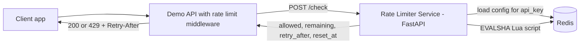

# Rate Limiter as a Service


A standalone service other apps call to ask: *"is this client allowed to make this request right now?"*
Three algorithms, configurable per API key, enforced **atomically** in Redis with Lua scripts so concurrent requests can't slip past the limit.

**Live demo:** https://rate-limiter-04h6.onrender.com/docs
(Free hosting: the first request after idle can take about a minute to wake up.)

## Features

- Fixed window, sliding window (log) and token bucket algorithms
- Per-API-key config (algorithm, limit, window, burst) stored in Redis, with CRUD routes
- Atomic check-and-consume in one Lua script per algorithm, using Redis `TIME` (not the app server clock)
- Read-only `GET /status` to peek at remaining quota without consuming any
- Configurable `fail_open` behavior when Redis is unreachable
- Demo app whose middleware returns `429` with `Retry-After` and `X-RateLimit-*` headers
- pytest suite (20 tests) including a concurrency test, k6 load test, Docker Compose, GitHub Actions CI

## Architecture



**Request flow**

1. The caller sends `POST /check {api_key, identifier, cost}`.
2. The service loads the key's config: `algorithm`, `limit`, `window_seconds`, `burst`.
3. It runs the matching Lua script, which reads, decides and writes in one atomic step.
4. It returns `allowed`, `remaining`, `retry_after` and `reset_at`.
5. The caller blocks with HTTP 429 when `allowed` is `false`.

## Algorithms

| | Fixed window | Sliding window (log) | Token bucket |
|---|---|---|---|
| How it works | One counter per window (`INCRBY` + `EXPIRE`) | Sorted set of request timestamps, old ones dropped | Tokens refill at a steady rate up to a capacity |
| Accuracy | Allows up to 2x bursts at window edges | Exact | Exact for the average rate |
| Burst handling | Poor at edges | None beyond the limit | Controlled bursts up to `burst` |
| Memory per key | O(1) | O(limit) | O(1) |
| Best for | Simple, cheap limits | Strict, accurate limits | APIs that allow short bursts |

## API

| Method | Route | Purpose |
|---|---|---|
| POST | `/check` | Check and consume quota |
| GET | `/status/{api_key}/{identifier}` | Peek remaining quota (consumes nothing) |
| GET | `/limits/{api_key}` | View config |
| PUT | `/limits/{api_key}` | Create or update config |
| DELETE | `/limits/{api_key}` | Remove config |
| GET | `/health` | Health check (pings Redis) |

```bash
BASE=https://rate-limiter-04h6.onrender.com

# create a key: token bucket, 5 requests per 10 s, burst of 5
curl -X PUT $BASE/limits/demo -H 'Content-Type: application/json' \
  -d '{"algorithm":"token_bucket","limit":5,"window_seconds":10,"burst":5,"fail_open":false}'

# consume quota
curl -X POST $BASE/check -H 'Content-Type: application/json' \
  -d '{"api_key":"demo","identifier":"user-1","cost":1}'
# {"allowed":true,"limit":5,"remaining":4,"retry_after":0.0,"reset_at":1790929584.395}

# peek without consuming
curl $BASE/status/demo/user-1
# {"limit":5,"remaining":4,"reset_at":1790929586.395}
```

## Design decisions

- **Atomicity with Lua.** A client-side read-then-write lets two requests both see "under the limit". Each algorithm is a Lua script, which Redis runs as a single atomic step.
- **Redis `TIME`, not app time.** Several app servers have clock skew; the Redis clock is the single source of truth.
- **Denied requests consume nothing.** Fixed and sliding window deny without writing a request; the token bucket saves the refilled tokens so time is never counted twice.
- **Memory stays bounded.** Every key has a TTL, and the sliding-window log is trimmed on each call.
- **Failure policy is per key.** `fail_open: true` allows traffic when Redis is down (availability); `false` returns 503 (protection).
- **Peek is its own set of scripts.** `GET /status` uses read-only copies of the check scripts, so peeking can never change the quota (tested).

## Load test results

k6, ramping to 200 virtual users over 70 s against `POST /check` (token bucket, 1000 distinct identifiers). Run locally in Docker Desktop with k6, the API and Redis all on one machine.

| Setup | Throughput | p95 | p99 | Errors |
|---|---|---|---|---|
| 1 uvicorn worker, default Redis pool | 1,502 req/s | 184 ms | 226 ms | 27.7% |
| 1 worker, blocking pool (max 100) | 1,236 req/s | 195 ms | n/a | 0.32% |
| **4 workers, blocking pool** | **4,248 req/s** | **61 ms** | **81 ms** | **0%** |

297,372 requests in the final run; median latency 35 ms.

**What the test found.** At 200 concurrent users the default Redis client raised `MaxConnectionsError: Too many connections`, which the service turned into 503s. Switching to a `BlockingConnectionPool` (requests wait for a free connection instead of failing) removed the errors, and running 4 workers removed the queueing that was driving latency.

Reproduce:

```bash
docker compose -f docker-compose.yml -f docker-compose.bench.yml up -d --build
k6 run loadtest/check.js
```

## Testing

```bash
docker compose up -d --build
pytest -v
```

- Unit tests per algorithm (limits, resets, refill, cost, capacity cap)
- **Concurrency test:** 200 parallel `/check` calls against a limit of 50; exactly 50 are allowed. This is the proof of atomicity.
- `/status` tests: repeated peeks never consume quota, and peeks match real usage
- CI (GitHub Actions) builds the stack and runs the whole suite on every push

## Limitations and next steps

- **No authentication on `/limits`.** Anyone with the URL can change or delete configs. This happened on the live demo during testing. A fix is an `ADMIN_TOKEN` header on the write routes.
- **Free hosting.** The demo sleeps when idle, and its free Redis is not persisted, so configs can disappear after a restart.
- **Single Redis instance.** To scale out, use Redis Cluster with keys sharded by `api_key` (hash tags keep one key's data in one slot), plus local in-memory pre-checks for hot keys.
- **Sliding-window memory** grows with the limit (one entry per request in the window), so it suits small and medium limits.
- Benchmarks were measured on one laptop, with the load generator sharing its CPU, so absolute numbers on dedicated hardware would differ.